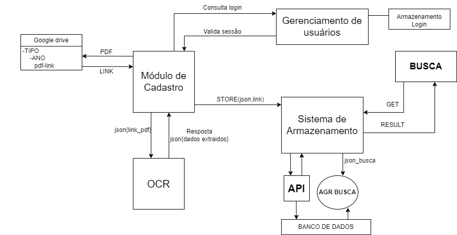
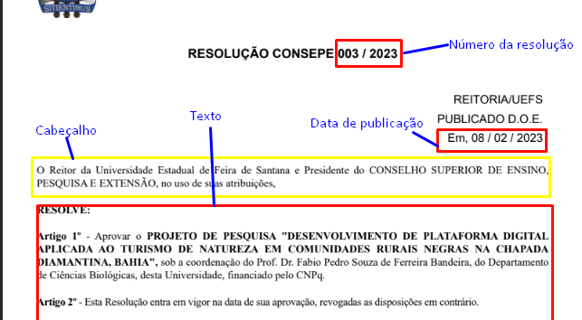

<h1> Projeto de extensão </h1>

Repositório para o projeto de extensão da disciplina EXA 844 Programação para redes da Universidade Estadual de Feira de Santana (UEFS)

<h3>Resumo do projeto</h3>

O projeto consiste no desenvolvimento de um engenho de busca para resoluções da UEFS, o sistema deve permite o cadastro de resoluções, busca de resoluções por ano , tipo, texto e etc.

<h3>Sobre o projeto</h3>

O projeto é dividido em quatro módulos individuais são eles: gerenciamento de usuários ,cadastro de resoluções ,armazenamento de dados e busca, módulo de extração de dados, a fim de que os módulos fossem desenvolvidos independentes um dos outros foi estabelecido que a comunicação entre módulos seria feita através de APIs construídas junto aos módulos.

<h4>Links de referência</h4>

<ul>
<li> <a  target="_blank"href="https://sites.google.com/a/ecomp.uefs.br/joao/home/courses/exa844">Site da disciplina</li><a>
<li><a   href="https://www.uefs.br/modules/conteudo/conteudo.php?conteudo=146" target="_blank">Página com resoluções</a></li>
<li><a href="http://uefsresolve.ecompjr.com.br/" target="_blank">Antigo buscador de resoluções</a></li>
</ul>

<h2>Módulos</h2>

<h3>Diagrama do sistema</h3>

<h3>Gerenciamento de usuários </h3>

O módulo de gerenciamento de usuários é responsável pelo cadastro e controle de usuários, existem dois tipos de usuários: administrador e usuário, Administradores tem a função do controle de usuários no sistema enquanto usuários podem cadastrar resoluções e alterar seus dados cadastrais.

Funcionalidades do Administrador:

<ul>
    <li>Cadastrar/Remover usuários</li>
    <li>Alterar senha dos usuários</li>
    <li>Listar usuários</li>
</ul>

Funcionalidades do usuário:

<ul>
    <li>Cadastrar resoluções (permissão)</li>
    <li>Alterar email e senha</li>
</ul>

Funcionalidades do sistema:

<ul>
    <li>Gerar Token de autenticação do usuário </li>
    <li>Verificar login do usuário </li>
    <li>Informação de cadastro de usuário: nome , email e senha</li>
</ul>

<h3>Extração de dados</h3>

O módulo de extração de dados é responsável pela extração dos dados das resoluções, o sistema acessa as resoluções em formato pdf faz a extração de dados e armazena no esquema estruturado definido para o projeto, algumas resoluções vão ser pdfs de documentos digitalizados sendo necessário utilizar Optical Character Recognition (OCR) para extrair os dados, o sistema deve gerar um json( no formato definido pelo projeto) para atender as requisições feitas na API construída. 

Funcionalidades do sistema:

<ul>
    <li>Recebe uma requisição do cadastro de resoluções que possui o link para um pdf baixa o pdf,faz a extração dos dados, formato do json recebido é 
        <a href="https://github.com/ALrEcompUefs/Projeto-de-extensao-resolucoes/tree/main/modelos_json">
            <strong>esquema_requisicao_para_ocr</strong></a>.</li>
    <li>Função definida: recebe como parâmetro um arquivo pdf e retorna um json de resposta com os dados do pdf.</li>
    <li>O formato do json de resposta segue o padrão definido no arquivo:
         <a href="https://github.com/ALrEcompUefs/Projeto-de-extensao-resolucoes/tree/main/modelos_json">
            <strong>esquema_dados_modulo_extracao.json na pasta modelos</strong></a>.</li>
</ul>

Na imagem abaixo é o mostrado recorte de uma resolução e são destacados os dados que devem ser extraídos dos documentos com exceção do reitor que pode ser encontrado ao final do documento.

    
<h3>Cadastro</h3>

O módulo de cadastro permite que os usuários com permissão possam cadastrar novas resoluções em formato zip informando ano e tipo da resolução no sistema, para ter acesso ao cadastro o usuário vai ter de realizar o login e autenticar sua sessão, as resoluções cadastradas devem estar disponíveis para acesso em formato pdf através de um link, ao cadastrar novas resoluções o sistema envia os links para o módulo OCR recebe os dados extraidos e envia para serem armazenados no banco de dados. 

Funcionalidades do sistema:

<ul>
    <li>Realizar login do usuário, faz uma requisição ao sistema de gerenciamento de usuário e recebe como resposta um token informando a sessão autenticada e as permissões do usuário.</li>
    <li>Cadastro de resoluções em arquivo compactado (formato zip) informando o ano e tipo(CONSEP ou CONSU).</li>
    <li>Extrair o arquivo o zip e separar as resoluções por tipo e ano</li>
    <li>Disponibilizar acesso as resoluções em formato pdf com link de acesso(sugestão google drive)</li>
    <li>Enviar requisições ao módulo OCR passando o link para pdf, utilizar json no formato 
         <a href="https://github.com/ALrEcompUefs/Projeto-de-extensao-resolucoes/tree/main/modelos_json"><strong>esquema_requisicao_para_ocr</strong></a></li>
    <li>Enviar json de resoluções extraidas para o módulo de armazenamento cadastrar a nova resolução</li>
</ul>

<h3>Armazenamento</h3>

Implementa o banco de dados do sistema onde os dados são indexados e podem ser recuperados nas consultas ao banco, o esquema de dados e tipo de banco: relacional, não relacional e outros fica a cargo da equipe.

Funcionalidades:

<ul>
    <li>Recebe uma requisição json  <a href="https://github.com/ALrEcompUefs/Projeto-de-extensao-resolucoes/tree/main/modelos_json"><strong>esquema_dados_modulo_extracao.json.</strong></a>
     e armazena no banco de dados</li>
    <li>Resoluções  já existentes no banco não devem ser cadastradas.</li>
    <li>O sistema deve indexar os dados.</li>
    <li>Deve permitir consulta dos dados, vai receber um json com dados chave para consulta e realizar a query correspondente.</li>
    <li>json deve ter os seguintes campos: keywords, from(data de início), to (data final)</li>
    <li>A requisição com os parametros de busca segue o formato 
         <a href="https://github.com/ALrEcompUefs/Projeto-de-extensao-resolucoes/tree/main/modelos_json">
            <strong>esquema_parametros_busca</strong></a></li>
    <li>Deve retornar como resposta para uma requisição recebida um json com dados no formato  
        <a href="https://github.com/ALrEcompUefs/Projeto-de-extensao-resolucoes/tree/main/modelos_json"><strong>esquema_resposta_busca_bd</strong></a></li>
</ul>

exemplo de uma requisição de busca para o sistema de armazenamento, ao receber uma requisição com o json no modelo abaixo:
 
 `
    {
    "palavras_chave":"engenharia de computação graduação CONSEP",
    "data_inicio":"",
    "data_final":"2018"
   }
`
  
Usando o algoritimo de busca implementado o sistema de armazenamento deve devolver um json com as resoluções que correspondem a busca, exemplo de resposta abaixo:

`
    {
        "ano":"2017",
        "orgao":"CONSEP",
        "descricao":"alteração do curriculo do curso ...... reforma",
        "numero":"004/2017",
        "link":"https://salvePdfs.com.br/store/cadastro-modulo/pdf1.pdf"
    }
`
`
function test() {
  console.log("notice the blank line before this function?");
}
`
